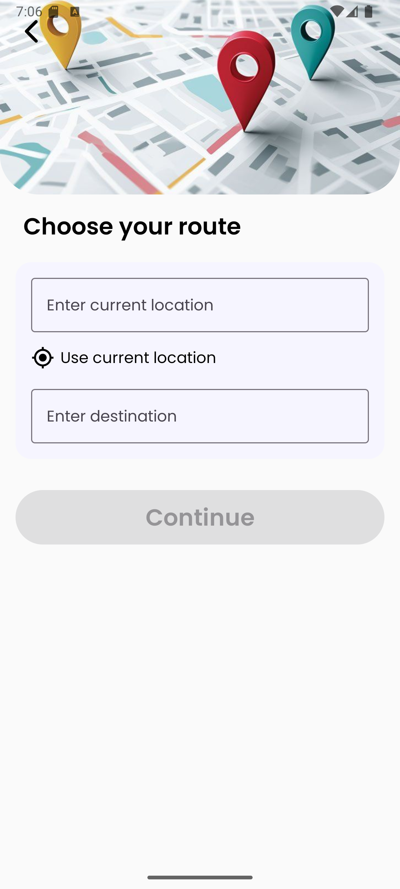
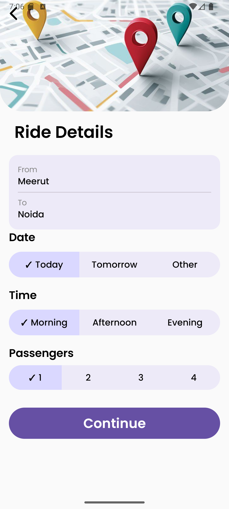
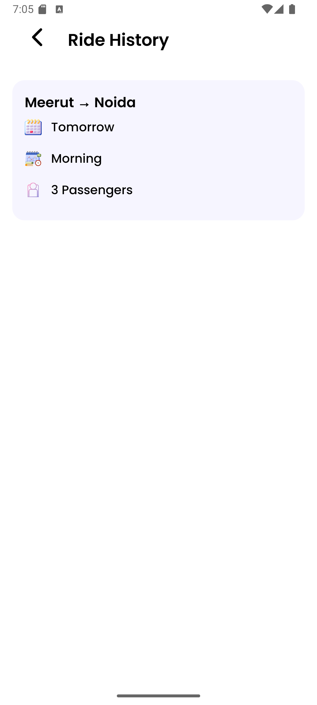

# 🚗 Ride Booking App (Jetpack Compose)

A simple and clean **Ride / Carpool Booking Android application** built using **Jetpack Compose**.  
The app allows users to plan a ride, select locations, choose date & time, confirm the booking, and view ride history stored locally using Room Database.

This project focuses on **modern UI design, smooth navigation flow, and basic Android architecture concepts**.

---

## ✨ Features

- 📍 Select pickup and drop locations
- 📅 Choose ride date and time
- 👥 Select number of passengers
- 🚘 View mock driver details
- ✅ Confirm ride booking
- 💾 Save ride details using Room Database
- 📜 View ride booking history
- 🎨 Clean UI built with Jetpack Compose
- 🔤 Custom typography using Poppins font
- 🔁 Smooth navigation between multiple screens

---

## 🧭 App Screens & Flow

1. **First Screen** – Get Started  
2. **Second Screen** – Choose Pickup & Destination  
3. **Third Screen** – Select Date, Time & Passengers  
4. **Fourth Screen** – Confirm Ride  
5. **History Screen** – View Past Ride Bookings  

---

## 🛠 Tech Stack

- **Language:** Kotlin  
- **UI Toolkit:** Jetpack Compose  
- **Architecture:** MVVM (basic)  
- **Database:** Room (SQLite)  
- **State Management:** State & Flow  
- **Navigation:** Navigation Compose  
- **Design System:** Material 3  
- **Version Control:** Git & GitHub  

---

## 📸 Screenshots

Below are screenshots of the main screens of the app.

| First Screen | Second Screen | Third Screen |
|-------------|---------------|--------------|
|  |  |  |

| Fourth Screen | History Screen |
|---------------|----------------|
|  |  |

